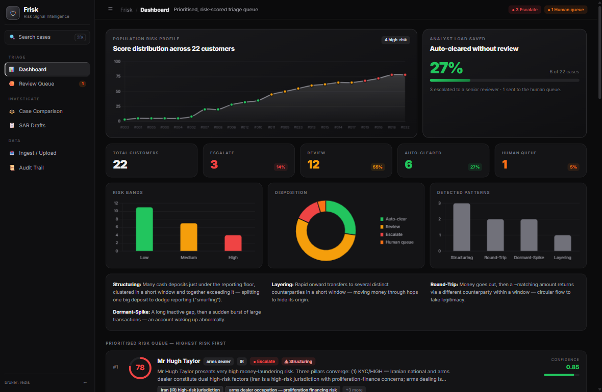
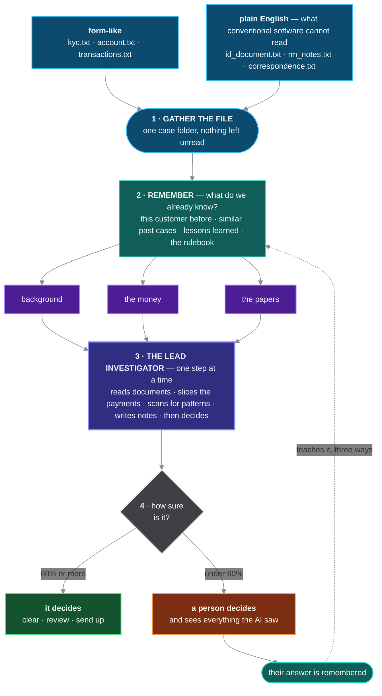
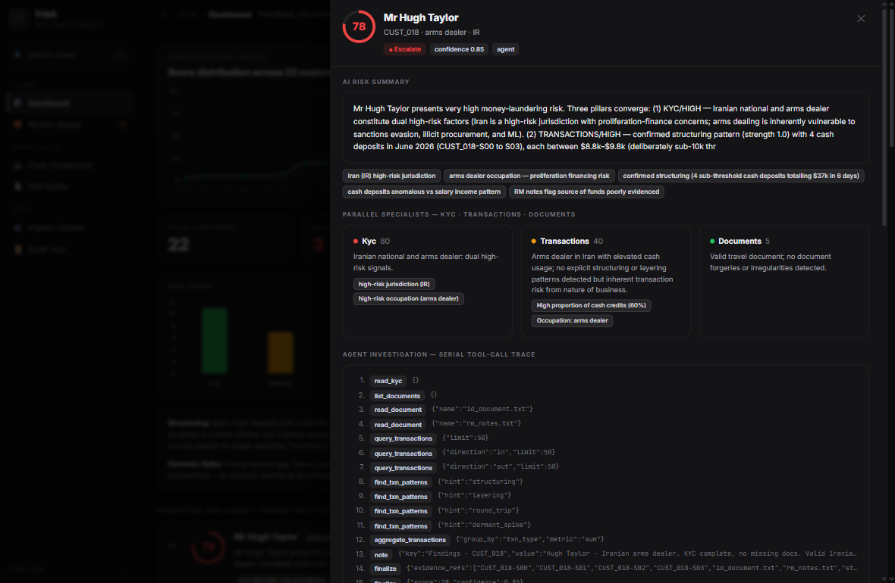
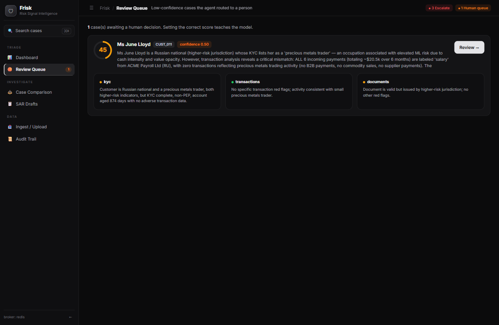
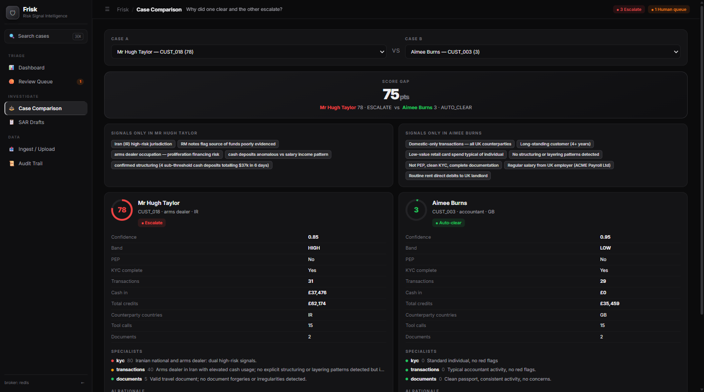
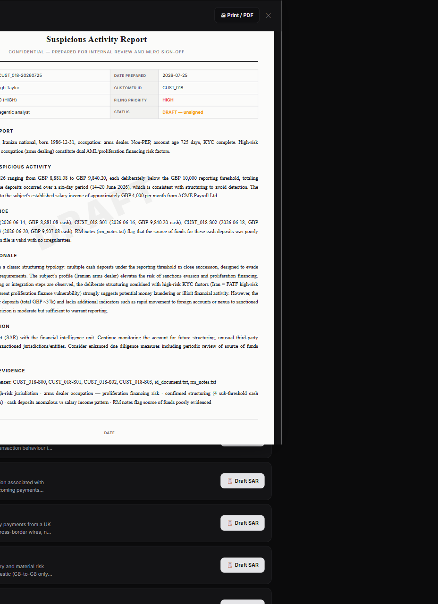
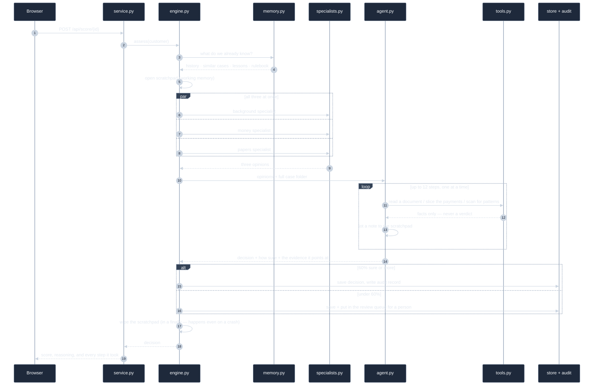

<div align="center">

# 🛡 Frisk — Financial Risk Signal Aggregator

**An AI that reviews customers the way a good analyst would — and hands you the evidence for every call it makes.**

Takes the scattered files a bank holds on each customer, reads all of them, and returns a **ranked list
of who needs attention first** — with the reasoning attached. When it is not sure, it says so and asks a
person. That answer then teaches it.

`Python 3.11+` · `FastAPI` · `LangChain tool-calling` · `Pydantic v2` · `SQLite + Redis` · `14 tests, no API key needed`

</div>



---

## Table of contents

[The problem](#the-problem) · [Quick start](#quick-start) · [How it works](#how-it-works) ·
[Key design decisions](#key-design-decisions) · [What you can do with it](#what-you-can-do-with-it) ·
[Worked example](#worked-example) · [Architecture](#architecture) ·
[Data & assumptions](#data--assumptions) · [Testing](#testing) · [Known limits](#known-limits)

---

## The problem

Banks are required to check their customers for signs of financial crime. The difficulty is not spotting
alarms — it is that the systems raise far too many. Industry figures put roughly **9 in 10 alerts as
false alarms**, with only **2–4% worth acting on**. Most of a reviewer's day goes to dead ends, and the
thinking behind each decision rarely survives in a form anyone can check later.

A reviewer opens one customer and finds five separate files that do not talk to each other:

| File | Shape | What it holds |
|---|---|---|
| `kyc.txt` | form-like | who they say they are, their line of work, whether they hold public office |
| `account.txt` | form-like | how long they have banked here, which product, which country |
| `transactions.txt` | table | what they actually did — hundreds of rows |
| `rm_notes.txt` | **plain English** | their banker's gut feeling, written out in prose |
| `id_document.txt` | **plain English** | what the ID scan actually said |

The two files that usually give the game away are plain English — **conventional software cannot read
them**. This creates three problems: it is **slow** (minutes per customer, with no sense of who to open
first), **inconsistent** (two reviewers give the same file two different answers), and **impossible to
explain** (the reasoning stays in someone's head).

> **Where the `.txt` files come from.** This project assumes an upstream document-processing pipeline
> already exists — the one that runs OCR over passport scans, pulls fields out of forms, and flattens
> everything into plain text per customer. Frisk starts where that pipeline ends. You can see it in the
> data: `id_document.txt` opens with `=== TRAVEL DOCUMENT — OCR EXTRACT ===`, because that is exactly
> what it is. Building that extraction layer is a separate problem, and a solved one.

**Frisk does the first pass.** It reads everything, digs the way a good reviewer would, puts the whole
customer list in order of risk, and shows its working — so the person starts with evidence instead of a
blank page.

> **The one rule that shaped the whole design:** missing a genuinely risky customer is a disaster;
> flagging a harmless one is merely expensive. Because those two mistakes are not equally bad, the system
> has to *admit when it is unsure and hand over* rather than bluff. That is why **how sure it is — not
> how bad the score is** — decides who sees a case.

---

## Quick start

### One command

```bash
git clone https://github.com/NeetigyaShah/frisk-risk-signal-aggregator.git
cd frisk-risk-signal-aggregator
./setup.sh --run
```

`setup.sh` creates a virtualenv, installs dependencies, generates the synthetic dataset, migrates the
database, runs the test suite, and (with `--run`) starts the server at **http://127.0.0.1:8000**.

<details>
<summary><b>Manual setup</b> — if you prefer, or on Windows PowerShell</summary>

```bash
python -m venv .venv
source .venv/bin/activate          # Windows: .venv\Scripts\activate

pip install -e ".[llm,api,dev]"    # or: pip install -r requirements.txt

python -m frisk.cli generate       # 20 synthetic customers (seeded, deterministic)
python -m frisk.cli samples        # 40 upload samples
python -m frisk.cli migrate        # create the database

pytest                             # 14 tests — no API key, no network
python -m frisk.cli serve          # → http://127.0.0.1:8000
```
</details>

### Configuration

Everything below is **optional** — the app runs fully without any of it.

| | |
|---|---|
| **AI key** | Put an [OpenRouter](https://openrouter.ai/keys) key in `.env` as `OPENROUTER_API_KEY=sk-or-v1-...` to run with a real model. Without one, a **built-in stand-in model** runs the whole app end to end with repeatable results — nothing is stubbed out. |
| **Model** | Default `deepseek/deepseek-v4-flash`. NVIDIA, Gemini and Anthropic swap in from `config/settings.py`. |
| **Redis** | `docker run -d --name frisk-redis -p 6379:6379 redis:7-alpine` — powers the review queue and the scratchpad. Falls back to in-memory if it is not there. |

> ℹ️ The first time you open the dashboard it reviews all 20 customers for real (~1–2 min, with a
> progress bar). That happens once — after that everything is read from storage.

### Commands

```bash
frisk serve              # start the app          → http://127.0.0.1:8000
frisk score --offline    # ranked list in the terminal (stand-in model, costs nothing)
frisk generate           # rebuild the 20 sample customers
frisk samples            # rebuild the 40 upload samples
frisk demo               # write 5 never-scored customers (for a live walkthrough)
frisk migrate            # create/upgrade the database
frisk reflect            # turn accumulated human corrections into lessons
```

---

## How it works

Every customer goes through the same four steps. There is **no scoring formula anywhere in the code** —
no weights, no point tables, no thresholds that add up to a number. The AI makes the judgement; the code
gives it the right tools, the right memory, and a set of rules it cannot break.



### 1 · Gather the file
The customer's files — some form-like, some plain English — are read into one tidy case folder. Money is
handled as exact decimals, never floating-point. A missing file degrades the run gracefully instead of
breaking it.

### 2 · Remember — five kinds of memory
Before anyone starts thinking, the system pulls together what it already knows. This happens *first*, so
every part of the pipeline works from the same background. It is the difference between a system and a
clever prompt — and it is what lets it improve over time.

| Kind of memory | What it holds | Where it lives | How long it lasts |
|------|---------------|----------------|----------|
| **Scratchpad** | notes it takes while working on this one case | Redis | wiped the moment it finishes |
| **This customer** | how we judged this person before | SQLite `assessments` | kept |
| **Past cases** | people who looked like this, and what a human decided | case bank | kept |
| **The rulebook** | what each crime pattern means, which places carry risk | reference files | fixed |
| **Lessons** | where it got things wrong before | SQLite `lessons` | grows as people correct it |

### 3 · Investigate — a team, then a lead
**Three specialists work at the same time** — one on background, one on the money, one on the paperwork.
Each sees only its own topic, so none of them can talk the others into anything. Each returns an opinion
in a strict format.

Those three opinions then go to **one lead investigator**, which works **one step at a time**: opening
documents, slicing the payment history different ways, running a pattern scan, jotting notes to itself —
then finishing with a decision. It gets 12 steps maximum, it may only point at evidence a tool actually
returned, and **the ordered list of what it did becomes the audit record**.

### 4 · Decide and learn
How sure it is decides what happens next. Confident cases it handles alone; shaky ones go into a **real
review queue** for a person. When someone corrects a score, that single correction teaches it three
ways: it becomes a **worked example** shown to similar customers later, a **written lesson** it reads
before every future case, and a **note on that customer's file**.

---

## Key design decisions

The six decisions below are the ones worth arguing about. Each one is a trade-off, not an obvious
default.

### 1 · No scoring formula — the AI produces the number

A traditional rules engine is easy to audit but completely blind to the plain-English files that carry
the strongest signal — and it is exactly what generates the 90%-false-alarm problem the industry
complains about. Handing the judgement to the AI trades perfect repeatability for the ability to read
prose and reason across sources.

**How we pay for that trade:** temperature set to zero, a strict output format, a full log of every step
it took, and a record of exactly what it remembered beforehand. Any decision can be **reconstructed**,
even though it is not byte-for-byte identical.

### 2 · A team working at once, then one lead working step by step

Two different shapes in one pipeline, for two different reasons:

|  | The 3 specialists | The lead investigator |
|---|---|---|
| How they work | all three at once | one step at a time |
| What they see | only their own topic | all three views plus the whole file |
| What they give | an opinion, not a verdict | the final call, with reasons |
| Why this way | fast, and no groupthink | each answer shapes the next question |

The lead works **one step at a time** because real investigation is like that — you cannot know which
document matters until you have looked at the money. The specialists work **all at once** because their
topics never overlap, so running them together is free and stops them talking each other into things.

### 3 · Tools suggest; the AI decides

The pattern scanner does not declare a customer guilty. It reports *candidates* — "four cash deposits
under the reporting limit within six days, rows S00–S03" — which the AI must then weigh up and point at.
A tool that returned `{"suspicious": true}` would turn the AI into a rubber stamp and quietly move the
real decision back into hard-coded logic.

This is also what makes the output checkable: to claim a pattern, the AI has to name the exact rows, and
every reference it gives is verified against what the tools really returned.

### 4 · Ask "how sure?", not "how bad?"

A middling score is not automatically a doubtful one — the AI may be very confident that a customer is a
plain, boring 58. What matters is whether the evidence genuinely backs the answer.

We ask the AI to rate its own certainty, and we tell it plainly that shaky cases go to a person. That
framing makes **owning up to doubt the winning move** rather than a black mark — which is the only way a
self-reported confidence is worth anything at all.

### 5 · It learns only from cases a person checked

Left alone, it would treat its own unchecked past decisions as precedent — quietly turning one early
mistake into a house rule. So it may only copy from cases a human actually signed off. It never learns
from its own unreviewed work.

### 6 · It can never come back empty

Running out of steps, an API failure, an unexpected crash — all of them still produce a *real decision*
handed to a person. Never a blank, never a silent zero. An early bug where it ran out of steps and
returned `score 0, sure 0` (which the system cheerfully read as a genuine "uncertain" case) is why the
only thing it is allowed to do in its final two steps is finish. A time limit needs a forced ending, not
just a buzzer.

<details>
<summary><b>Other things we hold ourselves to</b></summary>

- The scratchpad is wiped on **every** exit path — finished, handed over, or crashed
- The audit log can only be added to, never edited, and records clears as well as escalations
- Money is exact decimal arithmetic throughout; no floating-point on amounts
- The test data regenerates byte-identically every time, so results are comparable
- The plain-English search box never runs model output as code — only a fixed, typed filter
- Swapping the AI provider touches exactly one file

</details>

📐 **[Full architecture diagrams →](docs/ARCHITECTURE_DIAGRAMS.html)** (open in a browser)

---

## What you can do with it

| | |
|---|---|
| **Dashboard** | The whole customer list in order of risk, plus how the scores spread and which patterns turned up |
| **Case detail** | The entire investigation on one screen: the three specialists' views, every step it took, the evidence it pointed at, what it remembered, the payments with the odd ones highlighted, and the original documents |
| **Review queue** | The cases it was not sure about, with a form to set the right answer and teach it |
| **Case comparison** | Two customers side by side — exactly which signals differ, and why one was cleared |
| **SAR drafts** | A ready-to-review Suspicious Activity Report written from the case's own evidence |
| **Audit trail** | A permanent, uneditable record of every decision |
| **Ingest** | Upload your own documents, or review any batch of the 40 sample customers at once |

### The case view — the whole system on one screen


### When it is unsure, a person decides — and it remembers the answer


### Two customers side by side — why was one cleared and the other not?


### A real deliverable — the report an analyst would actually file


---

## Worked example

**Input** — `CUST_018`: a customer in a high-risk line of work, in a high-risk country. Four cash
deposits (`$8,881 / $9,840 / $9,248 / $9,507`) made within six days — each one landing just under the
$10,000 amount that would have triggered an automatic report.

**What it did** — 12 recorded steps:

| Step | Tool | What came back |
|---|---|---|
| 1 | `read_document` | opened the ID scan — passport checks out |
| 2 | `read_document` | read the banker's notes — cannot explain where the money comes from |
| 3 | `query_transactions` | pulled all 31 payments, £62,174 coming in |
| 4–9 | `query_transactions` | sliced them six ways — cash only, by counterparty, by date range |
| 10 | `find_txn_patterns` | flagged a possible deliberate-splitting pattern, rows S00–S03 |
| 11 | `note` | wrote to itself: *"4 deposits just under the limit, all inside 6 days"* |
| 12 | `finalize` | **83 · HIGH · send to a senior · 85% sure** |

**Output:**

```json
{ "score": 83, "band": "HIGH", "disposition": "ESCALATE", "confidence": 0.85,
  "evidence_refs": ["CUST_018-S00", "S01", "S02", "S03", "rm_notes.txt"],
  "key_signals": ["home country carries elevated risk", "high-risk line of work",
                  "four cash deposits totalling $37k in 6 days, each under the limit",
                  "banker cannot evidence where the money came from"] }
```

**Compare** — `CUST_000`, a teacher with a regular salary in and rent out:
**score 5 → LOW → cleared automatically** at 95% confidence. Same AI, opposite ends of the list.

---

## Architecture

```
src/frisk/
├── ai/
│   ├── agent.py          the lead investigator — works one step at a time
│   ├── specialists.py    the 3 specialists that run at the same time
│   ├── tools.py          what the AI is allowed to do (report facts, never verdicts)
│   ├── memory.py         fetching, assembling and writing back all 5 kinds of memory
│   ├── sar.py            writing the Suspicious Activity Report
│   └── providers/        the one place the AI provider is chosen (OpenRouter · NVIDIA · Anthropic · stand-in)
├── core/
│   ├── engine.py         the four steps, in order, with the guarantees enforced
│   └── models.py         the strict shapes everything must fit
├── data/
│   ├── generate.py       builds the sample customers, identically every time
│   ├── loaders.py        turns a folder, an upload or a paste into one case folder
│   ├── store.py          the database (customers, past decisions, lessons)
│   ├── casebank.py       past cases, for finding similar ones
│   └── reference/        the rulebook — crime patterns and higher-risk lists
├── hitl/
│   ├── queue.py          the queue a person works through
│   ├── scratchpad.py     working notes (wiped on every exit path)
│   ├── feedback.py       corrections from people
│   └── reflection.py     turning those corrections into lessons
├── api/service.py        the web server, which also serves the interface
└── frontend/             plain JavaScript, no build step
```

### What happens on one request



The interface is plain JavaScript with no build step, so getting it running is `git clone` →
`./setup.sh` → open a browser.

---

## Data & assumptions

- **20 made-up customers**, regenerated byte-identically every time (seed 42). No real people, no real
  personal data.
- Each is a folder mixing **form-like** files (`kyc`, `account`, `transactions`) with **plain-English**
  ones (`id_document.txt`, `rm_notes.txt`, `correspondence.txt`).
- **We assume a document-processing pipeline already ran.** The plain-English files are what such a
  pipeline would hand over — `id_document.txt` literally begins `=== TRAVEL DOCUMENT — OCR EXTRACT ===`.
  Frisk's job starts after extraction, not before it.
- **Watchlist and negative-news screening were deliberately left out of scope.** The brief asks for
  "external alerts / external data sources", so only the public-office flag is kept. Wiring in live
  watchlist feeds as *tools the AI can query* is the natural next step.
- The mix of risky and harmless customers is **deliberately unrealistic** — in reality well under 1% of
  customers are worth a second look. Here every risk level and every pattern appears, so a 20-customer
  demo actually exercises the whole system.
- Four known crime patterns are offered as **suggestions the AI must weigh**, never as automatic
  triggers: *deliberate splitting · rapid layering · money going out and coming back · a dormant account
  suddenly waking up*.

---

## Testing

```bash
pytest              # 14 tests — stand-in model, no API key and no internet needed
```

They check the promises this README makes: the sample data rebuilds identically · it always returns a
real decision · unsure cases really do reach a person · the scratchpad is wiped on every exit path,
crash included · it remembers past decisions and finds similar cases · it records what it remembered ·
the audit log cannot be edited · the specialists really do run at the same time · the search box cannot
be tricked into running code · reviewing many customers at once works.

---

## Known limits

| Where it is weak today | Why, and how we would fix it |
|---|---|
| **Takes 45–90 seconds per customer** | It is roughly 11 AI calls made one after another, each waiting ~3.2s. The step-by-step depth is the *point* — it is what a real investigation looks like — but most of that time is queueing on a shared public API. See below for how far this can come down. |
| **The same input can vary slightly** | An AI-produced score is not identical run to run. We hold it steady with temperature zero plus a full log of every step and everything it remembered. Next: lock the model version and store the exact question asked. |
| **It finds similar cases crudely** | Today it matches on a handful of features rather than on meaning. The lookup is written so that proper meaning-based search drops in unchanged once the case history is big enough to justify it. |
| **The 60% cut-off is a guess** | A sensible starting point, not a measured one. Next: compare its calls against real human corrections and tune the number to the evidence. |

### Getting the latency down

The 45–90 seconds is almost entirely **waiting on someone else's server**, not our own computation.
Nothing about the design has to change to fix it — only where the model runs:

| Change | Effect |
|---|---|
| **Host the model ourselves** | Removes the public-API queue and network round-trip — normally the single largest chunk of the wait. |
| **Use a small fast model for routine steps** | Most of the 12 steps are "fetch this and summarise it", not hard reasoning. A small model handles those in a fraction of the time; the big model is kept for the final judgement. |
| **Cache the unchanging part of the prompt** | The instructions and rulebook are identical on every call. Caching them means only the new part gets processed each time. |
| **Process many customers side by side** | Already implemented. One customer waiting on a reply does not block the next — a full book of customers costs barely more wall-clock than the slowest single one. |

Together these bring a full investigation **comfortably under 15 seconds** without touching a single line
of the reasoning logic. Worth being clear about the ceiling, though: a genuinely step-by-step
investigation can never be as fast as a lookup table. That is the price of it actually thinking, and it
is a price worth paying.

---

<div align="center">
<sub>Built as a take-home POC. Synthetic data only — no real customer information.</sub>
</div>
